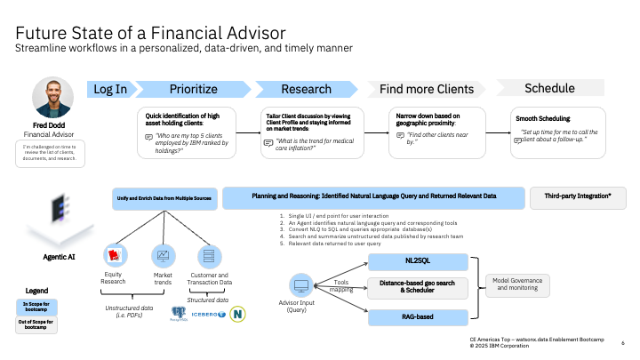

## Table of Contents
- [🥇 Wealth Manager Use Case](#-wealth-manager-use-case)
  - [🤔 The Problem](#-the-problem)
  - [🎯 Objective](#-objective)
  - [🏛 Architecture](#-architecture)
  - [📝 Step-by-Step Hands-on Labs](#-step-by-step-hands-on-labs)
    - [Environment Setup](#environment-setup)
    - [Labs](#labs)
      - [1. Data Warehouse Lab](#1-data-warehouse-lab)
      - [2. Data Lakehouse Lab](#2-data-lakehouse-lab)
      - [3. Data Governance Lab](#3-data-governance-lab)
      - [4. Agentic RAG Lab](#4-agentic-rag-lab)
      - [5. Natural Language to SQL Lab](#5-natural-language-to-sql-lab)

# 🥇 Wealth Manager Use Case

FinWin Bank is an established leader in US financial services with 50+ years of experience in providing a comprehensive suite of solutions, including traditional and online banking, brokerage and wealth management, across a vast network of nationwide locations. 

Their IT infrastructure, however has grown organically, resulting in a hybrid environment spanning on-premises data centers and multpile cloud providers.

FinWin Bank is seeking IBN's industry expertise and technology leadership to provide a cost-effective, easily managed solution that minimizes disruption to their existing IT Systems.

## 🤔 The Problem

Financial advisors face overwhelming challenges each day, managing client relationships, making complex decisions, growing their wealth, and offering personalized plans for future goals—all while manually navigating internal processes and enterprise systems. Manually logging into various platforms is time-consuming and inefficient. 

## 🎯 Objective

* Unify and leverage curated enterprise data assets, enabling employees to access the right data at the right time.
* Facilitate easy data discovery, empowering employees to quickly locate relevant information.
* Implement intuitive AI tools to automate repetitive tasks and enhance financial advisor efficiency.

By automating these tasks, the company aims to bootst productivity so their wealth managers can focus on developing personalized and effective client strategies that drive client relationships.

## 🏛 Architecture

To streamline the research process, FinWin partnered with IBM to design a Multi-Agent Wealth Manager solution that drives productivity for financial advisors by helping them better prioritize, research, and prepare for client meetings.

This solution takes in natural language queries and does not
require the user to be an expert in SQL. Advisors can easily ask various client-and market-related questions and make informed decisions with easy access to the necessary data from internal and external sources.

This system harnesses the power of [watsonx Orchestrate](https://www.ibm.com/products/watsonx-orchestrate), IBM's no-code/low-code/pro-code product for developing agentic AI solutions, [watsonx.data](https://www.ibm.com/products/watsonx-data), IBM's hybrid, open data lakehouse for enterprise AI and analytics and [watsonx.ai](https://www.ibm.com/products/watsonx-ai), IBM's platform for hosting foundation models such as Large Language Models (LLMs).

 
## 📝 Step-by-Step Hands-on Labs

### Environment Setup
To run the steps in this hands-on lab portion of the bootcamp, you need access to **watsonx Orchestrate**, **watsonx.data**, and **watsonx.ai** which are provided for you as part of the preparation for this bootcamp.

- Check with your instructor to make sure **all systems** are up and running before you continue.
- Complete the [Environment Setup Guide](../env-setup/README.md) to setup your environment to run the (4) labs below.  

### Labs
#### 1. [Data Warehouse Lab](Lab1_Data_Warehouse_Optimization/Lab_1_Data_Offload_Guide.md)
#### 2. [Data Lakehouse Lab](Lab2_Data_Lakehouse/Lab2_Data_Lakehouse_Guide.md) 
#### 3. [Data Governance Lab](<Lab3_Data_Governance/Lab 3 wdi Data Protection Guide v2.md>)
#### 4. [Agentic RAG Lab](Lab4_Agentic_RAG/Agentic_RAG_Guide.md)
#### 5. [Natural Language to SQL Lab](Lab5_NL2SQL/NL2SQL_Guide.md)

